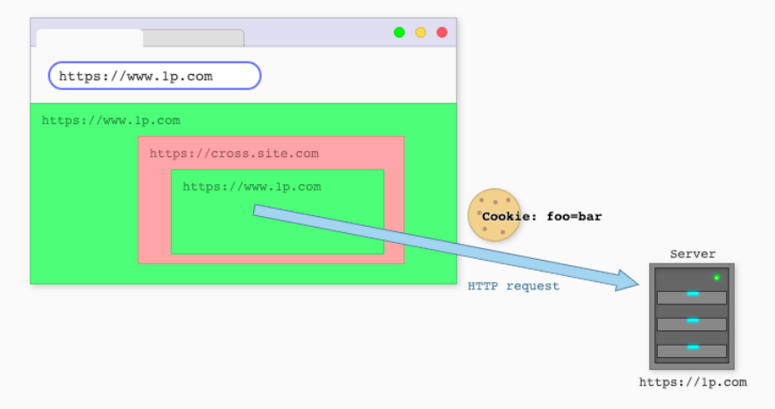
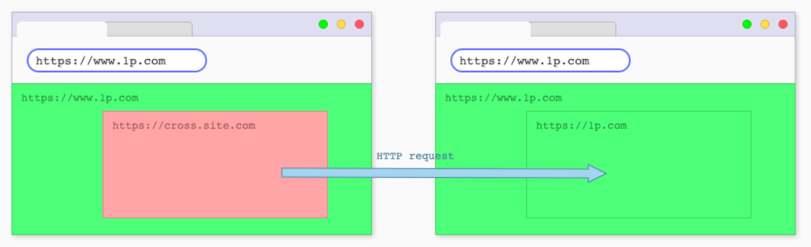

# Standardizing Security Semantics of Cross-Site Cookies

## Editors

- [Dylan Cutler](https://github.com/DCtheTall)
- [Kaustubha Govind](https://github.com/krgovind)
- [Johann Hofmann](https://github.com/johannhof)

## Table of Contents

- [The Problem](#the-problem)
- [Goals](#goals)
- [Non-Goals](#non-goals)
- [Proposal](#proposal)
    - [Guiding Principles](#guiding-principles)
    - [Overview](#overview)
- [Scenarios]
    - [Same-site Embeds with Cross-Site Ancestors (ABA embeds)](#same-site-embeds-with-cross-site-ancestors-aba-embeds)
        - [Security Considerations](#security-considerations)
        - [Developer Utility](#developer-utility)
        - [Recommendation](#recommendation)
    - [Navigating a Cross-Site Embed to a Same-Site Page](#navigating-a-cross-site-embed-to-a-same-site-page)
        - [Secuirty Considerations](#security-considerations-1)
        - [Developer Utility](#developer-utility-1)
        - [Recommendation](#recommendation-1)
    - [Top-Level Cross-Site POST Requests](#top-level-cross-site-post-requests)
        - [Security Considerations](#security-considerations-2)
        - [Developer Utility](#developer-utility-2)
        - [Recommendation](#recommendation-2)
    - [Redirecting a Cross-Site Subresource to a Same-Site Subresource](#redirecting-a-cross-site-subresource-to-a-same-site-subresource)
        - [Security Considerations](#security-considerations-3)
        - [Developer Utility](#developer-utility-3)
        - [Recommendation](#recommendation-3)

## The Problem

Major browsers have shipped or announced their plans to ship the blocking of cross-site cookies by default.
However, there are differing definitions of what “cross-site” could mean in this context and, as a result, major browsers' cross-site cookie blocking behavior has subtle differences.

This document is concerned with the security properties that arise from differences in treatment of SameSite=None cookies in certain scenarios, and seeks to drive alignment in browser behavior for these scenarios, keeping the privacy properties of cross-site cookie blocking.
The ultimate goal of this work is to promote interoperability and specify cross-site cookie blocking semantics for these configurations.

## Goals

This proposal aims to:

- Develop a shared understanding of cross-site cookie blocking and its potential security benefits between user agents and other stakeholders.

- To support these security benefits, specify common rules and semantics for cross-site cookie blocking, for future standardization in HTML, Fetch and the Cookies RFC.

- Discuss how existing proposals such as CHIPS or the Storage Access API might interact with cross-site cookie blocking to restore access to blocked SameSite=None cookies if needed.

## Non-Goals

- We do not intend to discuss or change the commonly agreed upon cross-site privacy boundary for cookies that some browsers have already established.
This proposal wants to discuss details on how this boundary might be designed pertaining both security and developer ergonomics, without compromising on its privacy properties.

- We want to avoid adding dependencies on non-existing APIs to solve problems outlined in this proposal.

- Most of the described behavior and APIs are shipping in browsers today and this document is an attempt to find pragmatic solutions that can be easily implemented and standardized.

- We encourage new proposals that build on top of this work to further strengthen the security posture through the development of new APIs.

## Proposal

### Guiding Principles

The primary reason for restricting cross-site cookies is protecting user privacy, because giving embedded resources access to single-keyed cookies in a third-party context allows for cross-site tracking.
As such, cookies should maintain a privacy boundary that is at least partitioned to the top-level site that any resource is loaded under.

Another important consideration is security. Cross-site cookies are key to a number of web application security vulnerabilities and [cross-site leaks](https://xsleaks.dev/).
As we improve the default security stance of the web through stricter cross-site cookie semantics, it is imperative to ensure developers are not caught unaware and put at risk by edge cases such as ABA embeds, as described below.

Finally, cross-site cookies remain a useful mechanic for many developers to build rich user experiences.
Where it aligns with the other two principles, we want to give developers the greatest possible flexibility and composability working with cross-site cookies.
This may involve utilization of other functionality such as CHIPS or the Storage Access API.

### Overview

In short, we want to propose the following updates to the current (unspecified) status quo:

- In embedded contexts, establish third-party cookie blocking based on "site for cookies" as the default behavior across user agents, except for “navigational requests” (iframe or top-level navigations) as outlined below.

- Update the Storage Access API to ensure that it grants access to unpartitioned cookies in the ABA embed scenario detailed below.

This tradeoff would retain developer utility in the outlined scenarios while providing effective default protections against [cross-site leaks](https://xsleaks.dev/).
It still relies on correct usage of SameSite=None for full protection against CSRF from cross-site navigations.

Once we have reached consensus on the final design, we would like to update the relevant specification documents and write web platform tests to exercise the outlined scenarios.

Additional details can be found below.

## Scenarios

### Same-Site Embeds with Cross-Site Ancestors (ABA embeds)

Sites will have embeds that are same-site with the top-level site, but the embed has at least one cross-site ancestor in the frame tree.
For brevity, we call these embeds ABA embeds.

When current third-party cookie blocking controls are enabled, major browsers' behaviors differ:

- Chrome will always block cookies in the ABA embed.

- Firefox allows the ABA embed to read cookies set by A as the top-level site, but the ABA embed cannot write new cookies.

- Safari allows ABA embeds to read and write cookies, including with headers in subresource requests to A that originate from an embedded site B frame.

#### Security Considerations

Allowing embeds with cross-site ancestors to have access to cookies has the consequence of also permitting any embedded site to make credentialed requests to the top-level domain.
This could allow malicious third-party sites to exploit [cross-site information leaks](https://xsleaks.dev/).
The cookie specification was [recently updated](https://developer.mozilla.org/en-US/docs/Web/HTTP/Headers/Set-Cookie/SameSite) to require that sites opt-in to cookies that need to be sent on cross-site requests with the SameSite=None attribute.
One may contend that this already offers websites some protection by default.
However, sites which enable SameSite=None cookies tend to have multiple endpoints, only some of which expect to be served in specific, trusted cross-site contexts.
Endpoints which don't expect cross-site interactions (and hence do not deploy sufficient protections against cross-site leaks or cross-site request forgery) might be unwittingly exposed to attacks from cross-site iframes.

#### Developer Utility

There are a few known use cases that utilize cross-site cookies in an ABA setup:

- [Salesforce for Microsoft Teams](https://appsource.microsoft.com/en-us/product/office/wa200002221?tab=overview); where the Salesforce services rely on Microsoft authentication services.

- [Google Classroom Add-Ons](https://blog.google/outreach-initiatives/education/classroom-add-ons/); where third-party add-ons services rely on authentication by Google

Given that both Firefox and Safari have so far not blocked SameSite=None cookies in this scenario, it is imaginable that there is other usage on the web.

However, we have APIs that can retain usability through an explicit opt-in to sending cookies in this case:

- Storage Access API, which would allow embedded A iframes to request access to SameSite=None cookies as in a traditional cross-site scenario.
  The Storage Access API would be updated to automatically grant these calls without requesting permission from the user, since the purpose of the SAA invocation is for the top-level site's security rather than the user's privacy.

- CORS: We could require use of CORS for any requests in an ABA setting. This would not prevent credentials from being sent, but it would allow the server to prevent leaking information to the intermediate “B” embedder.

#### Recommendation

In order to defend against these types of attacks, we recommend that ABA embeds which wish to use SameSite=None cookies must either invoke the (auto-granted) Storage Access API first, or opt-in via CORS.

### Navigating a Cross-Site Embed to a Same-Site Page

Another SameSite=None cookie use case with diverging browser behavior is navigation requests for cross-site embedded frames to a same-site page.

Currently, all major browsers will send the SameSite=None cookie in these navigations.
Should this be included in a spec as standard behavior?

#### Security Considerations

The ability of a cross-site iframe to force the top-level window to embed an arbitrary same-site endpoint as an `<iframe>` does not introduce a major risk of cross-site leaks – the attacker does not gain capabilities to learn information about the data loaded in the iframe.
The primary risk in this context is CSRF due to the possibility of initiating a credentialed navigation (via either a GET or POST request) to arbitrary same-site destinations.
This could be mitigated by allowing credentialed GET navigations, but restricting the sending of cookies on POST requests (most state-changing actions require non-safe methods such as POST).

Another potential attack in this scenario is clickjacking through iframing an unexpected same-site endpoint with state-changing functionality executed upon a user interaction with the embedded document.
However, the A > A relationship between top-level site and iframe generally does not allow attackers sufficient control over the embed to execute compelling attacks, substantially reducing the risk of such attacks.

#### Developer Utility

There are examples that rely on this kind of behavior (e.g. [login services provided by idp.elliemae.com](https://bugs.chromium.org/p/chromium/issues/detail?id=1179634)).
If SameSite=None cookies were blocked by default in this case, it would seem prudent to offer some more granular opt-in capability for developers.
We are currently lacking this capability (CORS would not prevent a credentialed request to the server unless preflighted).

#### Recommendation

Given the relatively low risk from this behavior and the lack of an alternative opt-in method, we should send SameSite=None cookies by default here.
We could aim to not send cookies for POST requests in this scenario, however, that might have a reduced effect depending on the feasibility of blocking cookies in the top-level cross-site POST requests scenario outlined below.

### Top-Level Cross-Site POST Requests

In this example, site A initiates a cross-site POST request to B which is also a top-level navigation.

In this case, the question is whether we want to have the browser send Site B's SameSite=None cookies in the POST request.
All major browsers currently do.

#### Security Considerations

As outlined in the previous section, POST requests usually change server state and as such are especially vulnerable to CSRF attacks via top-level navigation.
SameSite cookies exist as a protection mechanism for this attack.

#### Developer Utility

There seems to be very widespread usage of this pattern on the web, such as for [online credit card payments via 3D-Secure](https://github.com/GoogleChromeLabs/samesite-examples/blob/3d-secure-impl/3d-secure.md).
It might be possible to build an improved opt-in mechanism for this kind of scenario that allows for more fine-grained control over which sites are allowed to perform cross-site POST requests to other sites, compared to SameSite.
However, as stated in the Goals section, inventing such a mechanism is considered out of scope for this document.

#### Recommendation

Given the existing widespread usage and lack of clear alternatives, we recommend following the current state of the web and not blocking cross-site cookies in this scenario.

### Redirecting a Cross-Site Subresource to a Same-Site Subresource

Another edge case of SameSite=None cookies are when third-party requests, which have their cookies blocked by third-party cookie blocking, are redirected to a first-party domain.
We should consider standardizing that the redirected first party request should not get cookies.

Recently as part of ITP, Safari introduced [Cookie Blocking Latch Mode](https://webkit.org/blog/10218/full-third-party-cookie-blocking-and-more/), which blocks cookies in these redirected requests.

#### Security Considerations

If we allow cookies to be sent in these types of redirected requests, then it would be possible for an embedded site to redirect requests to its own server to endpoints of the top-level site.
This could potentially leak entropy to the embedded site about the top-level site's state for the user.

#### Developer Utility

Currently unknown.

#### Recommendation

Browsers which use SameSite for third-party cookie blocking already block cookies in these redirected requests, since these redirected requests are still considered cross-site for SameSite protections.
Therefore, we believe this should be specified as standard behavior.

We could require that top-level sites signal to browsers via some security opt-in that they are comfortable with sending SameSite=None cookies in these types of redirected requests.
